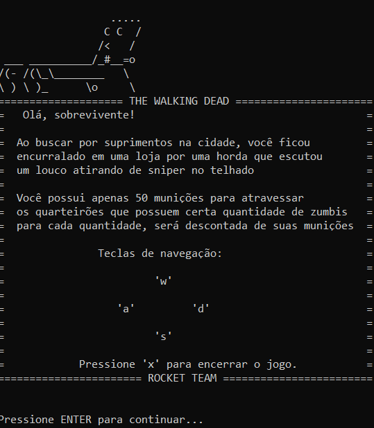

# 💀 The Walking Dead - C Game 🔫

Olá, sobrevivente! Está preparado para tentar escapar de uma grande encurralada? Você acaba de ser cercado por várias hordas de zumbis e possui apenas 50 munições para tentar sair vivo dessa.



# Índice
- 1. Como executar o jogo
    - 1.1. Como jogar no Linux
    - 1.2 Como jogar no Windows
- 2. Como compilar o código-fonte
- 3. Versões de desenvolvimento
- 4. Sobre o desenvolvimento

## 1.1. 🐧️ Como jogar no Linux
Faça o download do walkingdead.out para seu computador. Após, torne o jogo executável por meio do comando:
```bash
sudo chmod +x walkingdead.out
```

Sendo assim, basta executar o jogo e tentar a sorte!
```bash
./walkingdead.out
```

## 1.2. 🖼️️ Como jogar no Windows
Basta efetuar o download do walkingdead.exe e executar em sua máquina!

# 2. ☕ Como compilar o código-fonte

Para compilar o código-fonte, basta acessar a pasta src e abrir os códigos de acordo com seu sistema operacional (walkingdead.c para Linux e walkingdeadWin.c para Windows). Nota-se que é necessário algum compilador da linguagem C como o gcc instalado na máquina (independentemente do SO).

Caso esteja no Linux, é necessário adicionar a biblioteca gconio.h ao sistema caso não tenha. Para isso, acesse a pasta libs e execute o comando:
```bash
sudo cp gconio.h /usr/include
```
Assim a biblioteca será copiada para o sistema Linux e não terá problemas na compilação:
```bash
gcc walkingdead.c -o walkingdead.out     # Linux
gcc walkingdeadWin.c -o walkingdead.exe  # Windows
```
# 3. 🛠️ Versões de desenvolvimento

As versões de desenvolvimento funcionam de forma parecida com a build final, porém contendo munição infinita para que o jogador possa testar e possivelmente encontrar falhas no jogo e quiçá corrigí-las! Os exetutáveis compilados encontram-se no diretório dev, enquanto os códigos-fonte estão localizados na pasta src/dev. 

Para executar ou compilar, basta seguir os passos anteriores, porém agora utilizando os arquivos dev.

# 4. 🖥️ Sobre o desenvolvimento

Este jogo foi desenvolvido como um dos desafios para a disciplina de Estrutura de Dados I propostas pelo professor Adriano Antunes no curso de Bacharelado em Sistemas de Informação do Instituto Federal do Norte de Minas Gerais - Campus Januária.


